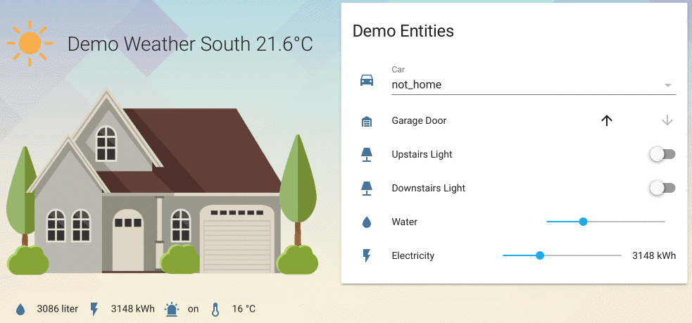
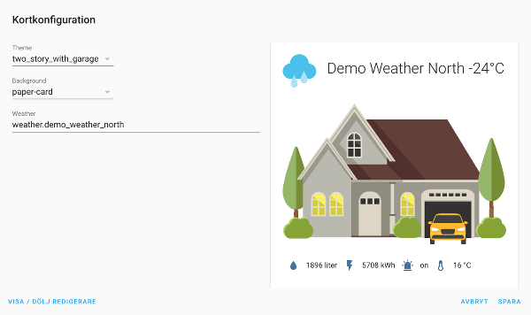

# Home Card

A quick glance of the state of your home in [Home Assistant](https://github.com/home-assistant/home-assistant) Lovelace UI.



Initial work on UI editor (only some options can be edited):



*Note: This card is still in early development (preview/proof-of-concept), beware of bugs and lacking features!*

## Features

* Graphical representation of your home with different themes
* Displays things such as weather, state of lights and garage door as well as arbitrary sensors
* Lovelace UI editor for some options (still early work)
* Flexible tap and hold actions (same as for entity-button)
* Create your own custom themes!
* Transparent or regular paper card background

## Roadmap

Some things I want to add in upcoming releases:

* More house types and better graphics
* Extend with additional overlays for things like alarm, people and doors
* More ways to customize how the card looks and feel
* Extend or override existing themes using `custom_themes`
* More improved Lovelace UI editor
* Support for custom_updater
* Better development environment with linting, etc.

## Install

### Simple Install

1. Download `home-card.js`, `themes.js` and `themes` and copy them into `config/www/home-card` (create the `home-card` directory)

2. Add a reference to `home-card/home-card.js` inside your `ui-lovelace.yaml`

  ```yaml
  resources:
    - url: /local/home-card/home-card.js?v=0
      type: module
  ```

### Git Install

1. Clone this repository into your `www`-directory: `git clone https://github.com/postlund/home-card.git`

2. Add a reference to `home-card/home-card.js` inside your `ui-lovelace.yaml`

  ```yaml
  resources:
    - url: /local/home-card/home-card.js?v=0
      type: module
  ```

### Custom updater

Not using this yet...

## Updating

If you...

* manually copied the files, just download the latest files and overwrite what you already have
* cloned the repository from Github, just do `git pull` to update

... and increase `?v=X` to `?vX+1`.

## Using the card

### Card layout

The card is split into three different areas:


Explanation of each area:

* Weather area (Red): Displays current weather with an icon (e.g. sun or cloud) and temperature. Name of location is displayed as well. Controlled by the `weather` option.
* House area (Green): Main visualization of the house. Consists of `overlay` images that can be shown or hidden depending on an entity state. A car overlay (image) can for instance be shown if `device_tracker.car` has the state `home`. Controlled by the `entities` option.
* Resources (Blue): Simplistic view of sensors. Controlled by the `resources` option.

Both the weather and resources areas are optional and will not displayed if omitted from the configuration. The house area are however mandatory.

### Options

| Name | Type | Default | Description |
|------|------|---------|-------------|
| type | string | **required** | `custom:home-card`
| theme | string | **required** | Name of a theme, see [supported themes](#supported-themes)
| background | string | transparent | Supported values: empty, `transparent`, `paper-card`
| weather | string | optional | `weather` entity used for displaying location and temperature
| entities | object | optional | List of [entity objects](#entity-object)
| resources | object | optional | List of [resource objects](#resource-object)
| custom_themes | object | optional | List of [theme objects](#theme-object)

#### Supported themes

The following themes and overlays are currently supported:

| Theme | Overlays |
|------|----------|
| two_story_with_garage | door, garage, outside_light, upstairs_light, downstairs_light, car, sprinkler

These states are supported by the overlays:

| Overlay | States | Component examples |
|---------|--------|-----------------------|
| car | home, not_home | device_tracker
| door | on, off | E.g. binary_sensor, switch
| downstairs_lights | on, off | E.g. light, binary_sensor
| garage | open, closed | cover
| outside_light | on, off | E.g. light, binary_sensor
| upstairs_lights | on, off | E.g. light, binary_sensor
| sprinkler | on, off | E.g. binary_sensor, switch

You may add additional state mappings using a `state_map` to support other component types, see [Entity object](#entity-object).

#### Entity object

An `entity object` maps an entity in Home Assistant to an overlay in the card, e.g. which `device_tracker` entity that shows/hides the car or which `light` that corresponds to "upstairs".

| Name | Type | Default | Description |
|------|------|---------|-------------|
| type | string | **required** | Overlay type, see [overlay tabe](#supported-themes)
| entity | string | **required** | Entity id from Home Assistant, e.g. `light.downstairs`
| state_map | map | optional | Key-value map of state (in Home Assistant) to overlay state

A simple example of an entity object in yaml looks like this:

```yaml
- type: car
  entity: binary_sensor_.car
  state_map:
    on: home
    off: not_home
```

This object supports custom [tap and hold actions](#tap-and-hold-actions).

#### Resource object

A `resource` is a simple sensor that is displayed beneath the house, e.g. a temperature sensor or water usage. You can use any entity but you might have to manually specify an `icon` and/or `unit_of_measurement`.

| Name | Type | Default | Description |
|------|------|---------|-------------|
| entity | string | **required** | An entity from Home Assistant, e.g, `sensor.water_usage`
| icon | string | optional | Override icon to use, e.g. `mdi:car`
| unit_of_measurement | string | optional | Override unit of measurement, e.g. `lux`

A simple example of a resource object in yaml looks like this:

```yaml
- entity: sensor.water_usage
  icon: mdi:water
  unit_of_measurement: liter
```

This object supports custom [tap and hold actions](#tap-and-hold-actions).

#### Theme object

**THIS IS EXPERIMENTAL AND MAY BREAK LATER - BEWARE!**

You can define your own themes and use your own images if you like. Some things to consider:

* Keep images small (in size) to keep everything snappy
* Re-use overlays and names as much as possible to keep themes consistent
* If you make a cool looking theme, feel free to send a PR (make sure to clarify where images come from to cope with licenses) and remember to include a screenshot
* It is currently not possible to alter/extend existing themes, only define additional themes

The format of this object will be described in more detail once the format has been set, but have a look at the [example](#creating-custom-themes) to see how you configure your theme in current state.

### Tap and hold actions

This card supports custom `tap` and `hold` actions for most things available in the card. Each theme defines the default behavior for how `tap` and `hold` works, but you may freely override this behavior. The exact same format as used by the `entity button` in lovelace is used here.

The following options are valid for `tap_action` and `hold_action`:

| Name | Type | Default | Description |
|------|------|---------|-------------|
| action | string | **required** | Action to perform, one of: `more-info`, `toggle`, `call-service`, `navigate`, `none`
| navigation_path | string | optional | Where to navigate (e.g. `/lovelace/1`) when `action` is `navigate`
| service | string | optional | Service to call (e.g. `switch.turn_on`) when `action` is `call-service`
| service_data | string | optional | Service data to include when calling a service (e.g. `entity_id: switch.bedroom`).

To see an example, click [here](#using-custom-tap-and-hold-actions).

### Example usage

#### Defining a home

Simple example using basic features:

```yaml
- type: 'custom:home-card'
  theme: two_story_with_garage
  weather: weather.home
  entities:
    - type: garage
      entity: cover.garage_door
    - type: upstairs_light
      entity: light.demo_upstairs_light
    - type: downstairs_light
      entity: light_downstairs_light
    - type: car
      entity: device_tracker.car
  resources:
    - entity: utility meter.water
    - entity: utility meter.electricity
    - entity: binary_sensor.movement_backyard
      icon: 'mdi:alarm-light'
    - entity: sensor.outside_temperature
      icon: 'mdi:thermometer'
```

#### Using custom tap and hold actions

Simple example using various `tap` and `hold` actions:

```yaml
- type: 'custom:home-card'
  theme: two_story_with_garage
  entities:
    - type: car
      entity: device_tracker.car
      tap_action:
        action: navigate
        navigation_path: /lovelace/2
      hold_action:
        action: more-info
  resources:
    - entity: sensor.outside_temperature
      tap_action:
        action: call-service
        service: switch.turn_on
        service_data:
          entity_id: switch.fan
      hold_action:
        action: none
```

#### Re-mapping states

Here, the `car` type is used as an example. It requires the specified entity to be a `device_tracker` as it maps states like `home` and `not_home` to different overlays. But you can add additional mappings to support for instance a `binary_sensor` as well using `state_map`, like below:

```yaml
- type: 'custom:home-card'
  theme: two_story_with_garage
  entities:
    - type: car
      entity: binary_sensor.car
      state_map:
        on: home
        off: not_home
```

#### Creating custom themes

You can define you own themes quite simply using `custom_themes`. The basic structure looks like below (`car` is used to illustrate, you may add as many overlays as you like):

```yaml
- type: 'custom:home-card'
  theme: my_home
  entities:
    - type: car
      entity: device_tracker.car
  custom_themes:
    my_home:
      house: house.png
      overlay_actions:
        '*':
          tap_action:
            action: toggle
        car:
          tap_action:
            action: more-info
      overlays:
        car:
          home:
            - image: car_home.png
              style:
                left: 10%
                top: 10%
          not_home:
            - image: car_away.png
              style:
                left: 40%
                top: 40%
```

Some notes here:

* You can defined multiple images for each state if you like (as a list is used)
* `style` translates to CSS style attributes, so you may use any CSS attributes here
* The theme is called `my_home`, so a directory with the same name must be created in the `themes` directory and all images placed there
* The `house` option is the main backdrop image and must be defined
* Overlay name (e.g. `car`) corresponds to `type` you specify under `entities` and may be anything you like (but try to be consistent with other themes to simply for other users in case you share your theme)
* If an entity in Home Assistant has a state that is not defined by its corresponding overlay, no overlay will be shown
* Different `tap_action` and `hold_action` configurations can be defined for specific overlay taps (like for 'car' in the example) or for all overlays using `*`.

## Issues and imitations

* Very limited lovelace editor support
* Only one theme built-in

## Getting errors?

Clear the browser cache, restart Home Assistant and make sure the configuration is correct.

If you believe you have found an error, please write an issue.

## External resources


### Images

This card uses some great free resources from Freepik, namely these:

* [Weather Icons](https://www.freepik.com/free-vector/weather-icons-collection_972339.htm)
* [House](https://www.freepik.com/free-vector/residential-houses-collection-flat-style_2065378.htm)
* [Car](https://www.freepik.com/free-vector/flat-car-different-views_1504979.htm)

### Other resources

The excellent `clear` theme is used in demo graphics, you can find it here:

https://community.home-assistant.io/t/clear-theme/100464

Background image is linked from the same page as well.